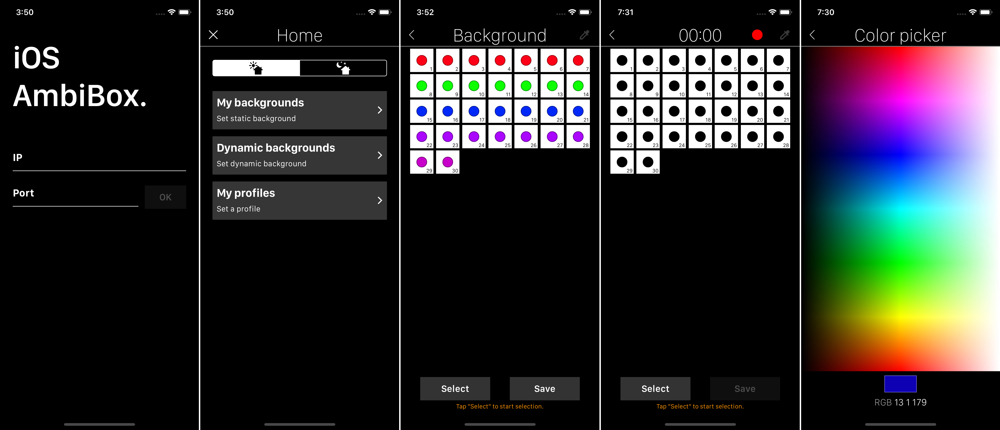

# AmbiBox Control

With this app, [AmbiBox](http://www.ambibox.ru/en/index.php/Download_AmbiBox) ambilight can be remotely controlled from an iPhone, through the AmbiBox [TCP API](http://www.ambibox.ru/en/index.php/API_server).

You can download it as it is in this repo (not available anymore in the App Store) and install it in your device with Xcode. I've made an [Instructables](https://www.instructables.com/AmbiBox-IOS-Remote-Control-App/) and a [video](https://www.youtube.com/watch?v=5A9H6IOgq54) to show how it works.

#### Disclaimer

I built it a long time ago, it was one of my first projects, so it needs a lot of improvement 😅. But it works nice and it can be used to control the ambilight without problem.

## Functionalities

Here is a list of all that can be done with the app.

#### 🌗 Turn on / off the the leds

Nothing more to explain.

#### 🌈 Static backgrounds

Set a color for each led or group of leds and create a colorful background that can be saved.

#### 🎆 Dynamic backgrounds

Make a recording of a color sequence, each led can have different colors and the recording is repeated in a loop. You can make interesting compositions and save them.

#### 🎬 Profile

The color of each LED is associated with an area of the screen. These areas are different in a modern film, where the image occupies the whole screen, than in an old film where the image may have two black stripes on top and bottom.

AmbiBox profiles permit the user to save different configurations, depending on the film.

This profiles can be chosen from the app.

## Flaws

To avoid cuts in communication with the server, the app must be in the foreground.

In background, it only holds for a few minutes ⌛ (it is okay if you are only going to answer a message). But if it goes to the background for a long time, the connection is lost.

I found a workaround 😅, after a few seconds of inactivity, the screen turns off so that it does not consume battery power, leaving the app in the foreground but with the screen off. When the user touches the screen, it turns on again.
